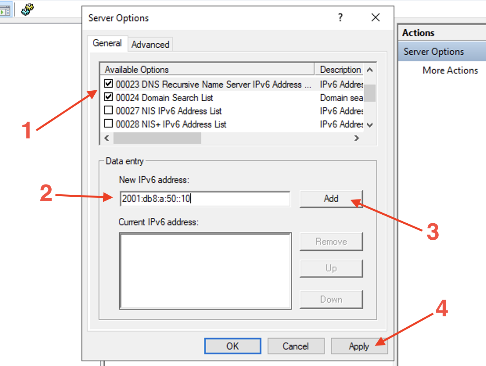
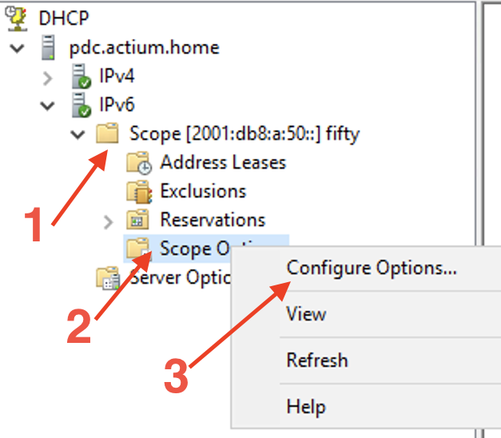
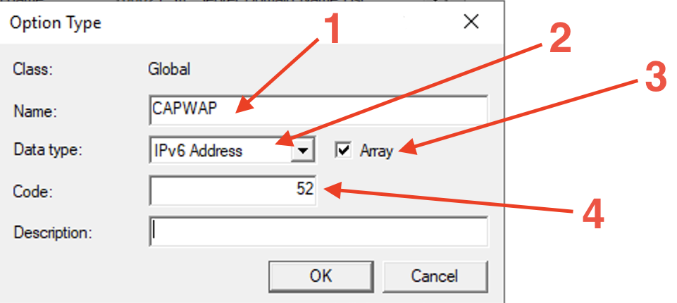

# aos-ipv6

This document details the various methods available to allow an Aruba access point to discover a controller in an IPv6 only environment.

## Aruba Access Point Boot Procedure

Aruba access points that are managed by a controller go through three phases in an attempt to make contact with the controller. This provides a robust provisioning process and flexibility in terms of campus network design.

1. DNS - The AP contacts a DHCP server which returns the DNS server address and DNS Search List. The AP then transmits a DNS query for 'aruba-master'. By default this will use the parent domain name of 'aruba-networks.com'. Hence why, for successful operation, the AP must learn the correct parent domain to create the resolvable FQDN.
2. DHCP - The AP contacts a DHCP server which provides the controller address via a configurable DHCP option. For IPv6 this is DHCPv6 Option 52 CAPWAP-AC-IPV6.
3. ADP - broadcast and multicast on the local LAN using this protocol. This option is only valid in an IPv4 environment.

## IPv6 Specific Design and Considerations

In order to communicate with its controller, an AP must obtain an IPv4 or IPv6 address. Address allocation for clients is a key differentiator between the IPv4 and IPv6 protocols.

With IPv4 the methods of address allocation are either statically assigned or via DHCPv4.
However, when using IPv6, address allocation functionality is incorporated into the protocol itself, thus expanding the methods in which a client can receive an address:

1. Static - user configured IPv6 prefix. Note that multiple IPv6 prefixes can be configured per interface.

2. Stateless Address AutoConfiguration (SLAAC) - a client can create its own globally routable address without the need to deploy a DHCPv6 server.
The local IPv6 gateway transmits Router Advertisement packets that contain one or more /64 prefixes with the RA flag 'Autonomous' flag, or the A flag, on. This tells the client to create its own address using the /64 from the RA as the first 64-bits, or Network ID, of the address and generating the latter 64-bits, or the interface identifier, itself. This functionality is active by default on all major operating systems including AOS8.
Moreover, in modern networks, clients often require more than just an IP address. Information such as DNS servers are vital to basic client operation. This data can be provided to a client using DHCPv4/DHCPv6 Options, but in a SLAAC environment there is no DHCP server. To address this, the IETF produced RFC6106 'IPv6 Router Advertisement Options for DNS Configuration' which detailed using Router Advertisements to communicate the Recursive DNS Server (RNDSS) and DNS
Search-List (DNSSL) to SLAAC clients. Please note that RFC8106 obsoletes RFC6106 but, at present, vendor datasheets and OS specifications still quote RFC6106 to indicate this general functionality.

3. Stateful DHCPv6 - Upon boot, depending on the OS implementation, the client will either attempt to contact a DHCPv6 server with a DHCPv6 Solicit packet or the local gateway will tell the client to use DHCPv6 via the Router Advertisement packet. The RA will have the Managed flag, or the M flag, set to on. Upon receipt the client will transmit DHCPv6 Solicit messages.
If the DHCPv6 server is on a different subnet, the local gateway must be configured with a DHCPv6 helper address pointing to the DHCPv6 server.
To summarize the basic operation of a successful DHCPv6 exchange, the server will issue an address to the requesting client which the client will use as its globally routable address.
Please note that the DHCPv6 server can also issue DHCPv6 Options in addition to the address. The relevant options in this environment as as follows:

* 23 - Recursive DNS Server
* 24 - DNS Search List
* 52 - CAPWAP
Also note that DHCPv6 and SLAAC are not mutually exclusive on a subnet. The local gateway can issue a Router Advertisment with the M flag set and one or more prefixes with the A flag on. By default, clients will auto-generate addresses based on the received A-flag enabled prefixes and still attempt to Solicit an address from a DHCPv6 server.

4. Stateless DHCPv6 - This method combines SLAAC for address configuration and DHCPv6 for the additional information found in DHCPv6 options.
The local gateway will issue one or more prefixes with the A flag on for the client to use to create their addresses. The gateway will also set the RA Other flag, or O flag, on. This tells the client to attempt to contact a DHCPv6 server for additional, non-address information.
The client transmits a DHCPv6 Information-Request and the DHCPv6 server returns the configured Options, without an IPv6 address.

Here is a summary of the four address allocation methods:

## Aruba Network Design Options

The multiple controller discovery methods open to Aruba access points, combined with the varying IPv6 address allocation and configuration methods creates numerous permeatations for network design and those that have been lab-tested are detailed here.

### 1. Stateful DHCPv6 with DHCPv6 Option 23 RDNSS and Option 24 DNS Search List

This design relies upon the DHCPv6 server to provide the information required to allow the AP to discover the local controller via a DNS query.

#### Summary

1. AP boots and transmits a DHCPv6 Solicit. 
2. DHCPv6 Solicit will received by a DHCPv6 Server on the same subnet, or forwarded by the local gateway to a remote DHCPv6 Server.
3. DHCPv6 Server responds to AP with a non-temporary /128 address and Options 23 RDNSS and Option 24 DNSSL.
4. The AP sends a DNS query to 'aruba-master.<your-domain>'.
5. The DNS server replies with the address, or addresses, for 'aruba-master.<your-domain>'. N.B. If the DNS server holds multiple AAAA records for 'aruba-master', these are included in the reply and the AP will query each in turn until communication with a controller is established. 
6. AP and controller exchange messages to negotiate IPSEC tunnel through which they then communicate.

Please note that when an Aruba AP boots it will begin transmitting DHCPv6 SolicitS and does not need to receive a Router Advertisement with the M flag on.
However, the gateway should not suppress RAs because the AP, and other local clients require the local prefix to determine that they are on-link.

#### Build Check-list

1. Deploy a DHCPv6 server with the required address lease range and DHCPv6 Options 23 & 24 either at the scope or the server level.
2. Configure the local gatway. See the notes below.
3. Deploy a DNS server with one or more AAAA record for the controller using the name 'aruba-master'.

#### Gateway Config Notes

1. The AP will transmit a DHCPv6 Solicit regardless of whether it has received a Router Advertisement. However, to ensure deterministic behaviour for other clients on the VLAN, set the M flag to on with `ipv6 nd ra managed-config-flag`.
2. The gateway will include the IPv6 prefix in the RA by default. This does not need to be explicitly configured.
3. However, by default, the prefix in the RA has the Autonomous flag set to on. Thus clients will use this prefix to generate their own IPv6 addresses using SLAAC. Disable this behaviour with `ipv6 nd ra prefix 2001:db8:a:50::/64 infinite no-autoconfig`.
4. Include the `ipv6 helper-address` command for remote DHCPv6 servers.

```
ipv6 unicast-routing
vlan 50
   ipv6 enable
   ipv6 address fe80::1 link-local
   ipv6 address 2001:db8:a:50::1/64
   ipv6 nd ra managed-config-flag
   ipv6 nd ra prefix 2001:db8:a:50::/64 infinite no-autoconfig
   ipv6 helper-address unicast 2001:db8:a:50::1
   exit
dhcpv6-relay
```

### 2. Stateful DHCPv6 with DHCPv6 Option 52 CAPWAP-AC-IPV6

Rather than rely on DNS records, the DHCPv6 server can provide the controller address to the AP directly as a DHCPv6 Option.

#### Summary

1. AP boots and transmits a DHCPv6 Solicit. 
2. DHCPv6 Solicit will received by a DHCPv6 Server on the same subnet, or forwarded by the local gateway to a remote DHCPv6 Server.
3. DHCPv6 Server responds to the AP with a non-temporary /128 address and Options 52 CAPWAP-AC-IPV6. Multiple addresses can be included in the Option 52 server configuration but the AP will only use one address learnt via this method. This limitation is one disadvantage of using the Option 52 method rather than DNS, multiple address can be used if learnt via DNS query.
5. The AP attempts to contact the controller using the Option 52 learnt address.
6. AP and controller exchange messages to negotiate IPSEC tunnel through which they then communicate.

#### Build Check-list

1. Deploy a DHCPv6 server and create DHCPv6 Option 52. 
2. Create a DHCPv6 scope and enable Option 52.
3. Configure the gateway.

#### Gateway Config Notes

See Design 1

### Design Note

Designs 1 and 2 can be combined, whereby the DHCPv6 returns RDNSS, DNSSL and CAPWAP-AC-IPV6.
The AP will query for 'aruba-master.<your-domain>' regardless of whether it holds a valid address via Option 52 or not.
In this case the AP will attempt to contact the controller using the address learnt via Option 52 first. If that fails, it uses the addresses returned in the DNS reply.

### 3. Stateless DHCPv6 with DHCPv6 Option 23 RDNSS, Option 24 DNS Search List

With this design the AP uses SLAAC for address configuration, DHCPv6 options to compose a DNS query and then uses that to resolve the controller address.

#### Summary

1. Upon boot the AP transmits a DHCPv6 Solicit. This is ignored by the DHCPv6 server. 
2. The AP receives a Router Advertisement from the local gateway containing a /64 prefix with the Automonous flag on, and the Other flag also on.
3. Using the /64 prefix as the network portion the AP generates the lower /64 to create its own IPv6 address.
4. The AP then transmits a DHCPv6 Information-request packet requesting Options 23, 24 and 52.
5. The DHCPv6 Server responds to the AP with a DHCPv6 Reply packet containing the RDNSS and DNSSL details.
6. The AP sends a DNS query to 'aruba-master.<your-domain>'.
7. The DNS server replies with the address, or addresses, for 'aruba-master.<your-domain>'.
8. The AP attempts to contact the controller via the DNS learnt address or addresses.
9. The controller and AP exchange messages to negotiate an IPSEC tunnel for communication.

#### Build Check-list

1. Deploy a DHCPv6 server with Options 23 and 24 configured at the Server level. There is no address scope in use here.
2. Configure the gateway.

#### Gateway Config Notes

1. The local gateway needs to be configured to send the AP's on-link /64 prefix with the Autonmous flag on. By default ArubaOS-Switch devices will send the /64 prefix in an RA with the A flag on. Thus the only configuration required to complete this step is to configure the gateway's interface with an IPv6 address in the appropriate /64 prefix.
2. The gateway must also set the Other flag in its RAs to on. This is configured with `ipv6 nd ra other-config-flag'.
3. Ensure the `ipv6 helper-address` is configured for remote DHCPv6 servers.

```
ipv6 unicast-routing
vlan 50
   ipv6 enable
   ipv6 address fe80::1 link-local
   ipv6 address 2001:db8:a:50::1/64
   ipv6 nd ra other-config-flag
   ipv6 helper-address unicast 2001:db8:a:50::1
   exit
dhcpv6-relay
```

### 4. Stateless DHCPv6 with DHCPv6 Option 52 CAPWAP-AC-IPV6

This design has the DHCPv6 server return only the controller address in its Reply.

#### Summary

1. As with Design 3, the AP boots and transmits and DHCPv6 Solicit that is ignored and generates its IPv6 address once an RA is received.
2. The AP transmits a DHCPv6 Information-request in response to the Other flag in the RA.
3. The DHCPv6 server responds with a DHCPv6 Reply containing the controller address as the Option 52 CAPWAP-AC-IPV6 value.
4. The AP attempts to contact the controller using the address in the DHCPv6 Reply.
5. The controller and AP exchange messages to negotiate an IPSEC tunnel for communication.

#### Build Check-list

1. Deploy a DHCPv6 server and create Option 52 CAPWAP-AC-IPV6.
2. Configure Option 52 at the Server level.
3. Configure the gateway.

#### Gateway Config Notes

See design 3.

### Restrictions

1. ADP does not work in an IPv6 only environment.
2. Each design requires a DHCPv6 server. SLAAC alone with RFC6106/RFC8106 Options is not currently supported.


## Appendix A: How to deploy a DHCPv6 server (Windows & Linux)

### Windows 2016 / 2019

#### DHCP Server Installation

1. `Start > Server Manager > Manage > Add Roles and Features`

2. Proceed to the Server Roles screen and tick `'DHCP Server' > Add Features`

3. Proceed to Confirmation then hit 'Install'

4. The DHCP Server Feature will then install. You can close that window down and the process will run in the background.

5. Once complete there will be a warning in Server Manager for 'Post-deployment Configuration'. 

6. Hit the link 'Complete DHCP configuration'. You can continue through the configuration with the default settings.

#### DHCPv6 Configuration

1. `Start > Windows Administrative Tools > DHCP`

2. Expand your Server to reveal 'IPv4' and 'IPv6'


##### DHCPv6 Stateless 

Only DHCPv6 Options are returned to the client.

1. Right-click `'Server Options' > Configure Options`


2. Configure the required options such as Option 23 RDNSS, Option 24 DNSSL.  
   If you wish to communicate the controller address to the AP using DHCPv6 Option 52 it can be enabled here. Ensure you have completed the steps to create this Option first. See below.



##### DHCPv6 Stateful

1. Right-click `IPv6 > New Scope`
2. Complete the 'New Scope Wizard' to configure the Scope name and prefix, any excluded addresses and the lifetime.
3. Hit Finish to activate the Scope.
4. To add DHCPv6 Options, expand the Scope and right-click `'Scope Options' > Configure Options`



Configure the desired options, see DHCPv6 Stateless above for details.

##### Configure Option 52 - CAPWAP-AC-IPV6

The CAPWAP-AC-IPV6 option is not included in the default list of DHCPv6 Option on Windows Server and must be manually created before it can be applied.

1. Right-click 'IPv6' under your server in the DHCP window.
2. Select `'Set Predefined Options' > Add`
3. The 'Option Type' window will open.
4. Name the option, such as 'CAPWAP-AC-IPV6'
5. For Data Type select 'IPv6 Address' from the drop-down menu.
6. Tick the 'Array' box.
7. Enter Code 52 then OK



8. Activate this new Option under Scope Options, for DHCPv6 Stateful or Server Options for Stateless.

### Ubuntu Linux

Install the ISC DHCP server:

```
sudo apt update
sudo apt-get install isc-dhcp-server
```

#### DHCPv6 Configuration

1. Edit the DHCP server configuration file in your preferred editor. It is good practice to make a copy of the original first.
```
sudo cp /etc/dhcp/dhcpd6.conf /etc/dhcp/dhcpd6.conf.old
sudo nano /etc/dhcp/dhcpd6.conf
```
2. The ISC DHCP server uses as a single configuration file. To enable DHCPv6 Stateful or Stateless edit this file as appropriate:

```
# DNS Server addresses
option dhcp6.name-servers 2001:db8:a:50::10;
# DNS Search ListServer
option dhcp6.domain-search "actium.home";
# IPv6 subnet and the range within that subnet to offer addresses from
subnet6 2001:db8:a:50::/64 {
        range6 2001:db8:a:50::200 2001:db8:a:50::299;
}
```

##### Configure Option 52 - CAPWAP

The DHCPv6 CAPWAP option is configured in the dhcp6.conf file.
First create the option then apply it to a subnet:

```
# create option 52 capwap-ac-v6
option dhcp6.capwap-ac-v6 code 52 = array of ip6-address;
# apply to a subnet
subnet6 2001:db8:a:50::/64 {
	range6 2001:db8:a:50::100 2001:db8:a:50::115;
    option dhcp6.capwap-ac-v6 2001:db8:a:50::30;
}
```
