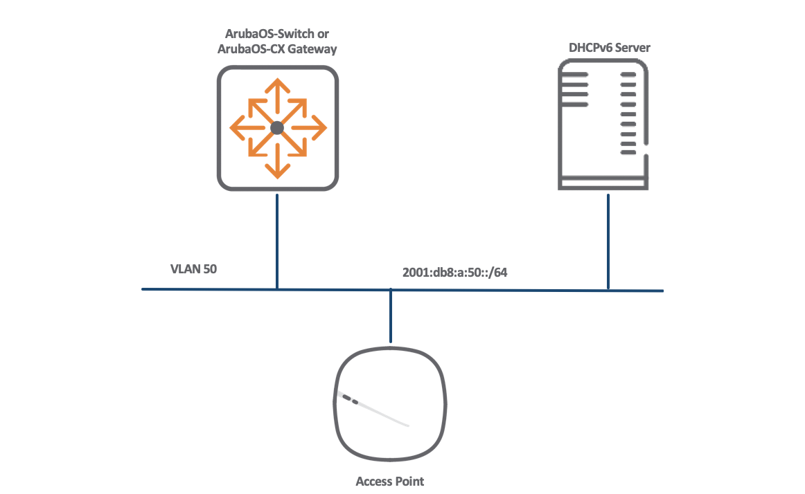
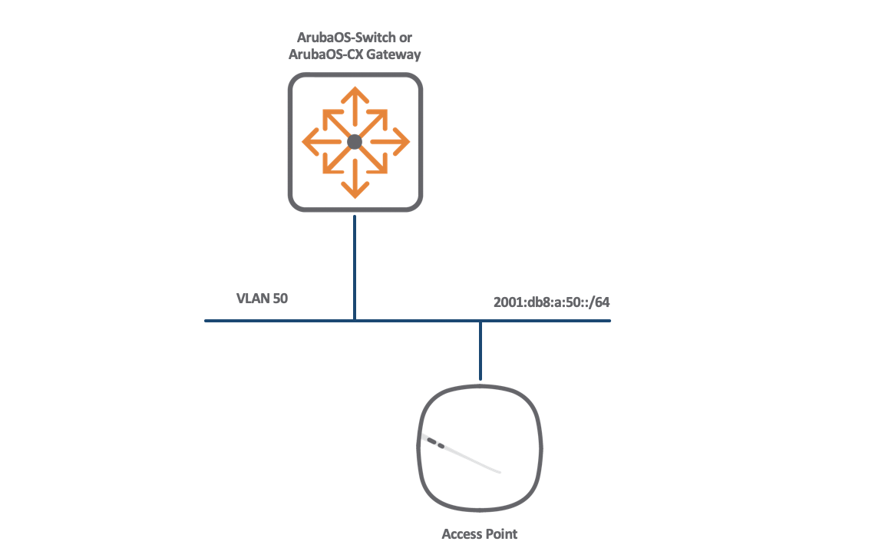

# Aruba Instant IPv6

This document describes Aruba Instant IPv6 network designs.

## Aruba Instant Overview

Aruba Instant is a controller-less, yet fully-featured, wireless architecture. As such it lacks the 'Controller discovery' concerns of ArubaOS installations.
There are, however, a number of options when it comes to Instant network design stemming from the considerations inherent in IPv6 networks.
By default an Aruba Instant Access Point, or IAP, is configured for IPv4 only. However once online, the AP can be configured for IPv4 & IPv6 dual-stack.

### Aruba Instant Boot Procedure

1. Upon boot an IAP will attempt to receive an IPv4 address via DHCPv4.
2. If no DHCPv4 server is available, the AP will self-assign a 169.x.x.x v4 address.
3. The IAP will listen for other IAP on the LAN. If there are other IAPs, the new AP will attempt to join the IAPs in a cluster as a slave. If no other APs are heard from, the new AP will become the Master.
4. Once the AP has finished its boot procedure, it can be configured via SSH, console or by joining the Setup SSID and using the web management interface.
5. The IAP factory-default configuration is enabled for IPv4 addressing only. Once the CLI or web-interface is available, the IAP can be configured to support dual-stack i.e. receive an IPv4 and IPv6 address with the following command:
   ```
   ap (config) # ip-mode v4-prefer
   ap (config) # exit
   ap # commit apply
   committing configuration...
   ```
6. Please note that even though the AP is in an IPv4 only state, it can boot into an IPv6 only network and be configured via the console or SSID without IPv4 deployment.  
7. Once the AP is configured for dual-stack it can receive an IPv6 address via DHCPv6 or Stateless Address Auto-configuration (SLAAC), see below for details.
8. Once the IAP receives its IPv6 address via either method, it will complete boot and be available for configuration and new WLAN deployment. Please note that the Web GUI and SSH for management are available over an IPv6 only network.

#### Clustering
Clustering allows multiple IAPs to form a master/slave relationship and automatically create a single interface for management and configuration.
1. Upon first boot, an IAP will attempt to discover local IAPs, if none are heard from the IAP will promote itself to Master.
2. Subsequent IAPs that boot on that LAN will again attempt dicovery, find that there is an existing Master, build a clustering relationship and enter a slave state. 
3. Configuration from the Master IAP will be copied to each slave IAP.  
   
Thus in an IPv6 network, only the first IAP must be configured for dual-stack with `ip-mode v4-prefer` and all slave IAPs will copy this configuration allowing them to boot and receive an IPv6 address without user intervention.

#### Address Allocation: DHCPv6
The DHCPv6 address allocation function can be hosted on a dedicated server such as Windows /2016/2019 or a Linux distribution.

##### Example DHCPv6 Network Diagram



##### Gateway Configuration Notes

1. The AP will transmit a DHCPv6 Solicit regardless of whether it has received a Router Advertisement. However, to ensure deterministic behaviour for other clients on the VLAN, set the M flag to on with `ipv6 nd ra managed-config-flag`.
2. IPv6 addressing best practise advises that LAN segments are configured with a /64 prefix, regardless of the number of clients. However, /64 prefixes, by default are transmitted in the local gateway's Router Advertisement with the Autonomous flag set to on, which clients will then use to generate their addresses using SLAAC. To prevent this behaviour, configure the local gateway to turn off the A flag with `ipv6 nd ra prefix <your-prefix> infinite no-autoconfig` for ArubaOS-Switch or `ipv6 nd prefix default valid 4294967295 preferred 4294967295 no-autoconfig` for ArubaOS-CX.
3. If the DHCPv6 server is not installed on the local LAN, configure `ipv6 helper-address` pointing to the remote server.

###### Example ArubaOS-Switch Configuration
```
ipv6 unicast-routing
vlan 50
   ipv6 enable
   ipv6 address 2001:db8:a:50::1/64
   ipv6 nd ra managed-config-flag
   ipv6 nd ra prefix 2001:db8:a:50::/64 infinite no-autoconfig
   ipv6 helper-address unicast 2001:db8:a:50::1
   exit
dhcpv6-relay
```

###### Example ArubaOS-CX Configuration

```
interface vlan50
    ipv6 address 2001:db8:a:50::1/64
    ipv6 nd prefix default valid 4294967295 preferred 4294967295 no-autoconfig
    ipv6 nd ra managed-config-flag
    no ipv6 nd suppress-ra
    ipv6 helper-address unicast 2001:db8:a:50::10
```

#### Address Allocation: SLAAC
An IAP can allocate its own globally routable IPv6 address by listening to Router Advertisements from the local gateway and using SLAAC. This approach has the advantage of eliminating the need for a DHCPv6 server function.

##### Example SLAAC Network Diagram



##### Gateway Configuration Notes

1. The SLAAC process with automatically activate if an AP receives a /64 prefix with the Autonmous flag set to on.
2. If using an ArubaOS-Switch or ArubaOS-CX gateway, configure a /64 prefix on a Layer 3 VLAN interface and the gateway will transmit an RA, which includes the prefix with the A flag on.

###### Example ArubaOS-Switch Configuration
```
ipv6 unicast-routing
vlan 50
   ipv6 enable
   ipv6 address 2001:db8:a:50::1/64
   exit
```
###### Example ArubaOS-CX Configuration

```
interface vlan51
    ipv6 address 2001:db8:a:51::1/64
    no ipv6 nd suppress-ra
```

#### Verification

The IPv6 address of an AP can be viewed with the following command:

```
ap# show ipv6 int brief
  IPv6 is enable, link-local address is fe80::cab5:adff:fec6:e470/64
br0 is up, line protocol is up
  Global unicast address(es):
    2001:db8:a:51:cab5:adff:fec6:e470/64, subnet is 2001:db8:a:51::/64
  IPv6 is enable, link-local address is fe80::cab5:adff:fec6:e470/64
```

### Unified AP

#### Overview

An Aruba Unified Acess Point offers flexibilty and convenience with the ability to automatically detect whether it should operate as a Campus AP or an Instant AP.
Upon boot a UAP will attempt to discover any local controllers, and if any are present it will transition to a Campus AP.
However, if no controllers are discovered, the UAP will operater as an Instant AP and activate the master/slave election, joining a cluster if other IAP are detected.

#### Unified AP and IPv6 only network

* By default, a UAP is configured for dual-stack.
* Thus, if a Unified AP boots in a controller-less IPv6 network, it will transition to IAP mode and accept an IPv6 address via DHCPv6. It does not need to be configured to accept an IPv6 address.
* If a UAP is deployed to an existing IAP IPv6 only network, it can successfully form a cluster with its peer IAPs.
